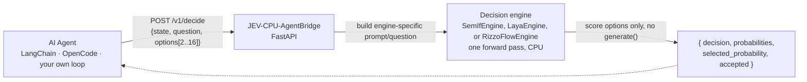
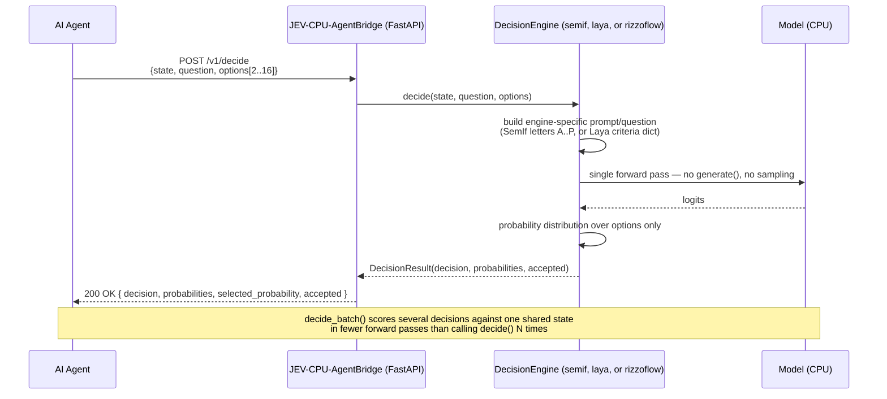

<p align="center">
  
</p>

<p align="center">
  <strong>Stop paying a full LLM call for a yes/no.</strong><br>
  A local, CPU-only decision engine that answers your agent's small discrete choices in milliseconds — for free.
</p>

<p align="center">
  
  
  
  <a href="https://github.com/GiskardB/jev-agentbridge/actions/workflows/ci.yml"></a>
</p>

---

## What is this

Every AI agent constantly makes small binary or few-way calls: *retry or abort? escalate or log? accept or reject?*
Routing those through a full generative LLM (OpenAI, Anthropic, OpenRouter...) burns tokens, money, and 1-15
seconds of latency for a decision that's really just "pick A, B, or C".

**JEV-CPU-AgentBridge** is a local, CPU-only FastAPI gateway that answers those routine discrete choices in milliseconds — for free. It runs a small model (Qwen3-0.6B, ~600M params) locally on CPU only and scores just the option letters via a single forward pass — no text generation, no GPU, no external API call. Your main agent model stays free to do the actual reasoning; this handles the judgment calls.

Measured on this repo's own [OpenCode example](examples/opencode-docker/): the same decision took **~2s locally
for $0**, vs **~15.7s and 586 tokens** through OpenRouter (qwen3-32b) — **~7.9x faster**. Your numbers will vary
with hardware and prompt size; see [docs/performance.md](docs/performance.md) before you rely on a latency figure.

## How it works



No `model.generate()` is ever called — it's a single forward pass plus a probability distribution over
a handful of options, which is what makes it fast enough to run on a CPU.

### Sequence diagram



## Pluggable engines

The scoring backend is swappable — the API your agents call (`/v1/decide`, SDKs, integrations)
never changes. Pick the image tag that matches the engine you want; the engine is baked into the
image so `JEV_ENGINE` is **not needed** (override it with `-e JEV_ENGINE=...` only if you want a
different engine at runtime):

| Image tag | Engine | What it is | Extra setup |
|---|---|---|---|
| `:latest` / `:semif` | `semif` (default) | Qwen3-0.6B causal LM, next-token scoring, runs in-process | none |
| `:laya` | `laya` | Non-autoregressive encoder models ([NandhaKishorM/laya](https://github.com/NandhaKishorM/laya)), runs in-process | none — dependencies already baked in |
| `:rizzoflow` | `rizzoflow` | llama.cpp + Spark-X2.5 GGUF via [Rizzo-AI-Academy/rizzo-flow](https://github.com/Rizzo-AI-Academy/rizzo-flow) — also usable as a general JEV integration point | run RizzoFlow itself separately (its own `rizzo serve`), then set `JEV_RIZZOFLOW_URL` |

```bash
# semif (default) — nothing else to set
docker run -p 8000:8000 ghcr.io/giskardb/jev-agentbridge:latest

# laya — dependencies baked into the image, no env var needed
docker run -p 8000:8000 ghcr.io/giskardb/jev-agentbridge:laya

# rizzoflow — point at a RizzoFlow server you started separately (see their README)
# Works as a general JEV client too: replace the server URL and it will talk to any
# RizzoFlow-compatible backend you run yourself.
docker run -p 8000:8000 ghcr.io/giskardb/jev-agentbridge:rizzoflow \
  -e JEV_RIZZOFLOW_URL=http://host.docker.internal:8017
```

Adding a fourth backend is a new `DecisionEngine` implementation plus one line in
`engine/registry.py`; see [docs/architecture.md](docs/architecture.md#swapping-engines).

### How they compare

Laya's own published benchmarks (GPU, third-party numbers for "Jev") claim ~7.8x lower latency and
better calibration than a Jev-style causal-LM engine, but lose badly past ~50 options. Nobody had
published a real **CPU** head-to-head between semif and laya — the case this project actually cares
about — so we ran one:

| Metric (CPU, warm cache) | semif (Qwen3-0.6B) | laya (English, 421M) |
|---|---|---|
| Warm direct p50 | 720ms | 339ms (~2.1x faster) |
| Warm shared, batch of 3 | 1.506s | 0.852s (~1.8x faster) |
| Cold start | 11.6s | 34.3s (slower to spin up) |

Single machine (Intel i7-6700HQ, no GPU), single run — re-run `python -m benchmarks.run --engine
semif` vs `--engine laya` on your own hardware before trusting this for a real decision. Full
methodology and caveats: [docs/performance.md](docs/performance.md#measured-semif-vs-laya-cpu-warm-cache).

RizzoFlow ships a genuinely different model family and size (quantized Spark-X2.5, 1.7B-4B GGUF via
llama.cpp) at a different tradeoff point — it wasn't put through the same controlled benchmark, so
it isn't in that table. It was, however, run and verified for real on CPU here: `rizzo serve
--device cpu --size 1.7b --quant q4_k_m` answered our example decision correctly (`retry`, p=0.9966)
through this Bridge's own `/v1/decide`. RizzoFlow's own README is upfront that they hadn't tried
CPU-only before either ("not tried: we have no CPU number") — measure your own workload with
`python -m benchmarks.run --engine rizzoflow` once RizzoFlow is running.

## Quick start

Requires Docker. Pulls the published image — nothing to build:

```bash
docker run -p 8000:8000 ghcr.io/giskardb/jev-agentbridge:latest
```

```bash
curl http://localhost:8000/health
# {"status":"ok"}
```

<details>
<summary>Prefer docker compose, or want to build from source instead?</summary>

```bash
docker compose up          # pulls ghcr.io/giskardb/jev-agentbridge:latest
docker compose up --build  # builds from this checkout instead
```
</details>

### Your first decision

```bash
curl -X POST http://localhost:8000/v1/decide \
  -H "Content-Type: application/json" \
  -d '{
    "state": "A deployment failed because the health check timed out.",
    "question": "What should happen next?",
    "options": [
      {"id": "retry", "description": "Retry the deployment"},
      {"id": "abort", "description": "Abort the deployment"}
    ]
  }'
```

```json
{
  "decision": {"id": "retry", "description": "Retry the deployment"},
  "probabilities": {"retry": 0.81, "abort": 0.19},
  "selected_probability": 0.81,
  "accepted": true,
  "metadata": {"engine": "semif", "mode": "direct", "model": "Qwen/Qwen3-0.6B", "latency_ms": 210.4}
}
```

*(Note: `engine` in the metadata reflects the image you ran — `semif` is the default.)*

Full request/response reference: [docs/api.md](docs/api.md). Architecture details: [docs/architecture.md](docs/architecture.md).

## SDKs

### Python

```bash
pip install -e sdk/python
```

```python
from jev_agent_bridge import AgentBridgeClient

client = AgentBridgeClient("http://localhost:8000")
result = client.decide(
    state="Deployment failed",
    question="What should happen next?",
    options=[
        {"id": "retry", "description": "Retry deployment"},
        {"id": "abort", "description": "Abort deployment"},
    ],
)
print(result["decision"]["id"])
```

### TypeScript

```bash
npm install @jev-cpu/agentbridge
```

```ts
import { AgentBridgeClient } from "@jev-cpu/agentbridge";

const client = new AgentBridgeClient("http://localhost:8000");
const result = await client.decide({
  state: "Deployment failed",
  question: "What should happen next?",
  options: [
    { id: "retry", description: "Retry deployment" },
    { id: "abort", description: "Abort deployment" },
  ],
});
console.log(result.decision.id);
```

No SDK needed either — it's one HTTP call, so any language works.

## Integrating with your agent

### OpenCode (built-in, verified against a real OpenCode agent)

A plugin + skill are included in [integrations/opencode/](integrations/opencode/).

1. Install the plugin's own dependency:
   ```bash
   cd integrations/opencode && npm install
   ```
2. Point it at your running Bridge instance:
   ```bash
   export JEV_CPU_AGENTBRIDGE_URL=http://localhost:8000
   ```
3. Register it in `opencode.json`:
   ```json
   { "plugin": ["./integrations/opencode/plugin/jev-cpu-agentbridge.mjs"] }
   ```
4. The agent gets a `jev_decide` tool it can call directly — see
   [integrations/opencode/README.md](integrations/opencode/README.md).

This was verified by actually running the real `opencode` CLI (the `opencode-ai` npm package) against a
live OpenRouter model and watching it call `jev_decide` — not just by reading the code. That exercise
found and fixed two real bugs (wrong tool-registration shape, a `z.record()` schema that crashes
OpenCode 1.18.x's serializer); details in [integrations/opencode/README.md](integrations/opencode/README.md)
and [CHANGELOG.md](CHANGELOG.md). `integrations/opencode/npm test` re-checks the registration shape
without needing a full OpenCode session.

Separately, [examples/opencode-docker/](examples/opencode-docker/) benchmarks JEV against calling
OpenRouter directly (via the Python SDK, not the plugin) — useful for the latency/cost comparison, not
a test of the plugin itself:

```bash
docker compose -f examples/opencode-docker/docker-compose.yml up --build
```

### Other agent frameworks (generic pattern, bring your own wiring)

JEV-CPU-AgentBridge is just a REST endpoint, so it drops into any framework that supports custom tools /
function calling. These snippets are illustrative — only the OpenCode integration above has been tested
end-to-end in this repo.

<details>
<summary><strong>LangChain / LangGraph</strong></summary>

```python
from langchain_core.tools import tool
from jev_agent_bridge import AgentBridgeClient

client = AgentBridgeClient("http://localhost:8000")

@tool
def jev_decide(state: str, question: str, options: list[dict]) -> dict:
    """Ask JEV-CPU-AgentBridge to make a small discrete decision."""
    return client.decide(state=state, question=question, options=options)
```
</details>

<details>
<summary><strong>CrewAI</strong></summary>

```python
from crewai.tools import tool
from jev_agent_bridge import AgentBridgeClient

client = AgentBridgeClient("http://localhost:8000")

@tool("jev_decide")
def jev_decide(state: str, question: str, options: list[dict]) -> dict:
    """Local CPU decision for small discrete choices."""
    return client.decide(state=state, question=question, options=options)
```
</details>

<details>
<summary><strong>OpenAI function calling / Assistants API</strong></summary>

Declare it as a tool schema (mirrors `POST /v1/decide`), call the Bridge yourself when the model invokes it:

```json
{
  "type": "function",
  "function": {
    "name": "jev_decide",
    "description": "Local CPU decision for small discrete choices (2-16 options).",
    "parameters": {
      "type": "object",
      "properties": {
        "state": {"type": "string"},
        "question": {"type": "string"},
        "options": {
          "type": "array",
          "items": {
            "type": "object",
            "properties": {"id": {"type": "string"}, "description": {"type": "string"}}
          }
        }
      },
      "required": ["state", "question", "options"]
    }
  }
}
```
</details>

<details>
<summary><strong>Anthropic (Claude) tool use</strong></summary>

Same idea — declare a `jev_decide` tool with the schema above in your `tools` list, and when Claude requests
it, forward the input to `POST /v1/decide` and return the JSON result as the tool result block.
</details>

## Releases & CI

- Versioning follows [SemVer](https://semver.org/); see [CHANGELOG.md](CHANGELOG.md) for the release history.
- `.github/workflows/ci.yml` runs lint + tests on every push/PR, and verifies all engine variants build correctly.
- `.github/workflows/release.yml` builds and publishes Docker images whenever a `vX.Y.Z` tag is
  pushed — to [GitHub Container Registry](https://github.com/GiskardB/jev-agentbridge/pkgs/container/jev-agentbridge)
  on github.com, or to the local instance's registry when run on a self-hosted Forgejo/Gitea.

Image tags:
```bash
# Default (semif)
docker pull ghcr.io/giskardb/jev-agentbridge:latest
docker run -p 8000:8000 ghcr.io/giskardb/jev-agentbridge:latest

# Laya variant (engine baked in)
docker pull ghcr.io/giskardb/jev-agentbridge:laya
docker run -p 8000:8000 ghcr.io/giskardb/jev-agentbridge:laya

# RizzoFlow variant (general JEV integration point)
docker pull ghcr.io/giskardb/jev-agentbridge:rizzoflow
docker run -p 8000:8000 ghcr.io/giskardb/jev-agentbridge:rizzoflow
```

## Documentation

- [Architecture](docs/architecture.md)
- [API reference](docs/api.md)
- [Integration guide](docs/integration.md)
- [Performance / benchmarking](docs/performance.md)

## License

MIT — see [LICENSE](LICENSE).
