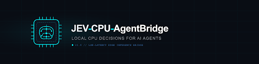
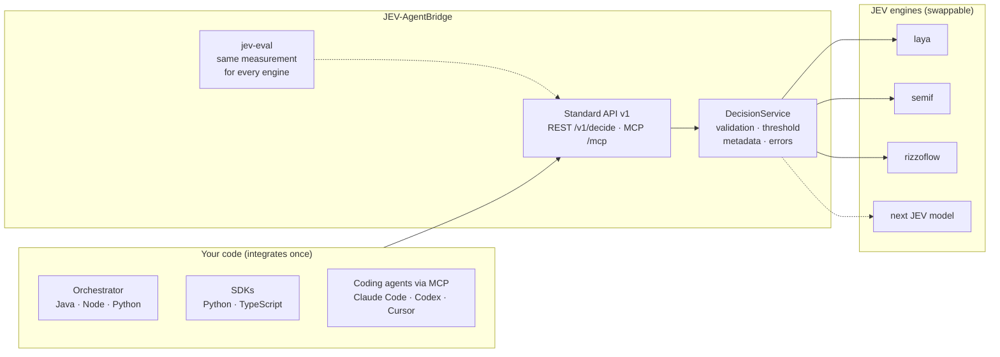

<p align="center">
  
</p>

<p align="center">
  <strong>One standard API for JEV decision models.</strong><br>
  A bridge between your agents and the JEV family of local decision engines:
  one contract, pluggable engines, the same way to measure them all.
</p>

<p align="center">
  
  
  
  
  <a href="https://github.com/GiskardB/jev-agentbridge/actions/workflows/ci.yml"></a>
</p>

---

## What this is

**JEV models** are small local models built to *choose* rather than *write*. Given some
evidence and a closed question, they score the possible answers in a single forward pass and
return a probability for each. The questions come in three types: **yes/no** (`noul`), **one
category out of 2–16** (`choice`) and **a level on an ordinal scale** (`score`). They need no text generation and can run locally, on CPU or GPU.
The family is young and moving fast. [semif](#engines) is a causal LM scored on option letters,
[Laya](https://github.com/NandhaKishorM/laya) uses non-autoregressive encoders,
[Kev](https://github.com/jaredpalmer/kev) puts LoRA and a pointer head on Qwen3.5, and
[RizzoFlow](https://github.com/Rizzo-AI-Academy/rizzo-flow) runs llama.cpp GGUF models. Each
comes with its own API, input format and definition of "confidence".

**JEV-AgentBridge is the standardization layer in front of them.** Your agents integrate
once, against one versioned REST contract (`/v1/decide`), SDKs and error model. Each JEV engine
plugs in behind it as an adapter. When a better JEV model appears, you swap the engine (an image
tag or one environment variable) and re-measure it with the bundled evaluation tools. Your code
does not change.



## What the bridge standardizes

Wiring the engines directly means handling their differences in every client. The bridge
removes them. These are real differences found while building the adapters:

| Concern | Engines as they come | Through the bridge |
|---|---|---|
| Request | Letters A–P in a prompt (semif), a `criteria` dict (Laya), a `questions` payload (RizzoFlow) | One request: `type`, `state`, `question`, `options[{id, description}]` |
| Question types | noul/choice/score in Laya and Kev, boolean/choice/score in RizzoFlow, choice only in semif | `choice`, `noul`, `score` on every engine: native where the engine has them, emulated as a choice where it does not |
| Probabilities | Keyed by letter (semif) or by option id (Laya, RizzoFlow) | Always one probability per **option id**, in request order |
| "Confidence" | Laya's `confidence` is 1 − normalized entropy; for example p = 0.64 comes back as 0.056 | `selected_probability` is always the chosen option's probability |
| Acceptance | Each engine had its own threshold logic, or none | One policy: `accepted = selected_probability ≥ threshold`, per request, per batch item or as the service default |
| Errors | Python exceptions, HTTP errors, timeouts | One envelope `{"error": {code, message, request_id}}` with stable codes (`ENGINE_UNAVAILABLE`, `INPUT_TOO_LARGE`, ...) |
| Batch | KV-cache prefix reuse (semif), multi-question calls (Laya, RizzoFlow) | One `/v1/decide/batch`; each engine uses its native shared path |
| Metadata | Engine-specific | Stable core (`engine`, `model`, `mode`, `latency_ms`); engine-specific data under `engine_details` |
| Quality | Each project publishes its own benchmark, on its own hardware | `jev-eval` and the evaluation suites measure every engine the same way, on your data |

## What it is not

The bridge does not make a JEV model smarter. Decision quality is the engine's quality, and it
varies a lot between engines. Measured on
this repo's [model-routing evaluation](examples/eval/model_routing/) (240 labelled requests,
choose the small / medium / large LLM tier):

| Configuration | Accuracy | English | Italian | Requests routed alone at ≥ 95% accuracy |
|---|---|---|---|---|
| LLM baseline (qwen3-32b, for reference) | **96.2%** | 95.8% | 96.7% | n/a |
| Kev-0.8B (remote, on CPU) | **80.4%** | 78.3% | **82.5%** | **60.0%** (both languages) |
| laya, English model (default engine) | 59.6% | 70.0% | 49.2% | 12.1% (English only) |
| semif, prompt v2 | 51.7% | 56.7% | 46.7% | 0% |
| semif, prompt v1 | 37.5% | 41.7% | 33.3% | 7.1% |
| laya, multilingual model | 34.6% | 37.5% | 31.7% | 0% |

On short, closed decisions (retry / rollback / escalate, ticket triage) the engines did better:
laya scored 83.3% on the 12-row English sample and 75% on the Italian one. Every figure,
with its caveats, is in [docs/performance.md](docs/performance.md#accuracy-and-threshold).

The same client code went from 12% to 60% of requests handled without the LLM by changing one
environment variable (`JEV_ENGINE=laya` → `kev`), with no confident errors (p ≥ 0.8) in either
case. That is the point of the bridge: build the integration and the measurement once, use JEV
only where `jev-eval` shows it is reliable, and let each new JEV model earn more traffic by
passing the same tests. Kev-4B and 9B, which need a GPU to be fast, were not measured here.

## Engines

Engines plug in two ways. **In-process** engines load the model inside the bridge. **Remote**
engines are HTTP clients to a model server that runs separately, with its own dependencies and
hardware. Remote adapters are written per protocol: TypeSafe's System One API
(`/v1/systemone`) is spoken by hosted Jev, Kev and RizzoFlow, so one adapter covers them all.

| Image tag | `JEV_ENGINE` | Kind | Engine | Notes |
|---|---|---|---|---|
| `:latest` / `:laya` | `laya` (default) | in-process | [Laya](https://github.com/NandhaKishorM/laya) non-autoregressive encoders | Multilingual Laya model by default (since 0.5.1); `JEV_LAYA_SUBFOLDER=english` for the English one, `typed-decisions` (not yet measured) for the third |
| `:semif` | `semif` | in-process | Qwen3-0.6B causal LM, next-token scoring of option letters | `JEV_SEMIF_PROMPT_VERSION=direct-options-v2` scores better than the default v1 |
| `:kev` | `kev` | remote | [Kev](https://github.com/jaredpalmer/kev) 0.8B / 4B / 9B. Best measured engine; run it with `docker-compose.kev.yml` | `JEV_KEV_URL` (default `http://localhost:8009`); GPU recommended for 4B / 9B |
| any image + `-e JEV_ENGINE=systemone` | `systemone` | remote | Any System One server. Tested with Kev; hosted Jev and RizzoFlow's `/v1/systemone` should work but are not yet tested | `JEV_SYSTEMONE_URL`, `JEV_SYSTEMONE_MODEL`, `JEV_SYSTEMONE_API_KEY` |
| `:rizzoflow` | `rizzoflow` | remote | [RizzoFlow](https://github.com/Rizzo-AI-Academy/rizzo-flow) through its native `/v1/decisions` (llama.cpp, Spark-X2.5 GGUF) | `JEV_RIZZOFLOW_URL` |

The engine is baked into each image, so the tag alone selects it (`-e JEV_ENGINE=...`
overrides it).

### Running Kev: one command

Kev needs Python 3.12+ and `torch < 2.9`, so it runs as its own container (`:kev-server`) next to
the bridge (`:kev`). [`docker-compose.kev.yml`](docker-compose.kev.yml) wires them together:

```bash
docker compose -f docker-compose.kev.yml up
```

REST and MCP are on `http://localhost:8000` as usual. The first start downloads Kev-0.8B (about
2 GB) and can take several minutes; the bridge starts when Kev is healthy. Kev-0.8B runs on CPU.
For Kev-4B or 9B, build the server image for CUDA and enable the GPU block in the compose file
(see the comments in [`docker/kev-server/Dockerfile`](docker/kev-server/Dockerfile)), then set
`KEV_RUN=jaredpalmer/kev-4b`.

<details>
<summary>Without Docker</summary>

```bash
git clone https://github.com/jaredpalmer/kev && cd kev
uv sync --extra serve
uv run --extra serve python -m kev.serve --run jaredpalmer/kev-0.8b --port 8009
# in this repo, in another terminal
JEV_ENGINE=kev uv run python -m uvicorn jev_agentbridge.main:app --port 8000
```
</details>

**Hardware.** The published images use CPU PyTorch, so in-process engines run on CPU there.
From source, `JEV_MODEL_DEVICE=cuda` works with a CUDA build of PyTorch. Remote engines use
whatever hardware their server has, which is how to put a JEV model on a GPU without changing
the bridge. Measured p50 latency on the routing evaluation, all on CPU: laya 0.35–1 s, semif
about 1.4 s, Kev-0.8B about 1.8 s. Kev on a GPU is tens of milliseconds, according to its README.
Check your own hardware with `python -m benchmarks.run --engine <name>`.

## Quick start

Requires Docker. Nothing to build:

```bash
docker run -p 8000:8000 ghcr.io/giskardb/jev-agentbridge:latest      # laya, starts in seconds
docker compose -f docker-compose.kev.yml up                          # Kev: more accurate, see Engines
```

The first start downloads the model (about 30–40 s for laya with a good connection). Then:

```bash
curl -X POST http://localhost:8000/v1/decide \
  -H "Content-Type: application/json" \
  -d '{
    "state": "A deployment failed because the health check timed out.",
    "question": "What should happen next?",
    "options": [
      {"id": "retry", "description": "Retry the deployment"},
      {"id": "abort", "description": "Abort the deployment"}
    ],
    "min_selected_probability": 0.6
  }'
```

Example response (values are illustrative):

```json
{
  "type": "choice",
  "decision": {"id": "retry", "description": "Retry the deployment"},
  "probabilities": {"retry": 0.81, "abort": 0.19},
  "selected_probability": 0.81,
  "accepted": true,
  "threshold": 0.6,
  "score": null,
  "noul": null,
  "metadata": {"engine": "laya", "model": "convaiinnovations/laya",
               "model_revision": "multilingual", "mode": "direct", "latency_ms": 340.2,
               "native_type": true, "engine_details": {"...": "..."}}
}
```

Yes/no and scale questions use the same endpoint with a `type`:

```bash
# yes/no: no options; the answer is "yes" or "no", and "noul" is P(yes)
curl -X POST http://localhost:8000/v1/decide -H "Content-Type: application/json" -d '{
  "type": "noul",
  "state": "Customer bought the shoes 10 days ago. Policy: returns within 30 days.",
  "question": "Is the return request within policy?"
}'

# ordinal scale: options are the levels, lowest first; "score" is the expected level (0..n-1)
curl -X POST http://localhost:8000/v1/decide -H "Content-Type: application/json" -d '{
  "type": "score",
  "state": "Our largest customer has a demo in 40 minutes and SSO login is broken.",
  "question": "How urgent is the request?",
  "options": [{"id": "low", "description": "Can wait days"},
              {"id": "medium", "description": "Within the day"},
              {"id": "high", "description": "Within the hour"},
              {"id": "critical", "description": "Right now"}]
}'
```

The type is for the caller: a yes/no answer comes back as `yes`/`no` with P(yes), a scale
keeps its order through `score`. The engine is asked the same way by default (as a choice over
`yes`/`no` or the levels), because on our measurements the engines' native yes/no and scale
paths were not better (Laya's native scale was clearly worse). `JEV_NATIVE_TYPES` turns them on.
Details and numbers: [docs/api.md](docs/api.md#question-types).

The response has the same shape whatever the engine. `accepted: false` means "not confident
enough, decide yourself"; it does not mean "no". Other endpoints: `/v1/decide/batch` (several
decisions on one shared state), `/v1/info` (engine and contract version), `/health`, `/ready`.
OpenAPI is served at `/openapi.json`. Full reference: [docs/api.md](docs/api.md).

<details>
<summary>docker compose, or build from source</summary>

```bash
docker compose up          # pulls ghcr.io/giskardb/jev-agentbridge:latest
docker compose up --build  # builds from this checkout instead
```
</details>

## Using it: a gate in front of the LLM

Call the bridge from your orchestrator's code at decision points where you would otherwise call
an LLM only to pick an option. If JEV is confident, use its answer. If it is not, or if the
bridge is down, ask the LLM as before. The SDKs implement this pattern:

```python
from jev_agent_bridge import AgentBridgeClient

jev = AgentBridgeClient("http://localhost:8000", timeout=2.0)
outcome = jev.decide_or_fallback(
    state="Deployment failed because the health check timed out",
    question="What should happen next?",
    options=[{"id": "retry", "description": "Retry"}, {"id": "abort", "description": "Abort"}],
    min_selected_probability=0.85,
    fallback=lambda request: ask_llm(request),  # returns an option id
)
print(outcome.decision_id, outcome.source)  # "jev" or "fallback"
```

```ts
import { AgentBridgeClient } from "jev-agentbridge-sdk";

const jev = new AgentBridgeClient("http://localhost:8000", 2_000);
const outcome = await jev.decideOrFallback(
  { state, question: "What should happen next?", options, min_selected_probability: 0.85 },
  async (request) => askLlm(request), // returns an option id
);
console.log(outcome.decisionId, outcome.source); // "jev" | "fallback"
```

It is plain JSON over HTTP, so Java or any other language needs no SDK; see
[docs/integration.md](docs/integration.md) for Node, Python and Java examples. Exposing JEV as a
tool that the LLM calls, over MCP, also works (see [Integrations](#integrations)), but it does
not reduce LLM cost: the LLM is already running when it emits the tool call.

## Measuring an engine before trusting it

The bridge ships the tools to decide, per decision type and per engine, whether JEV can be
trusted and at which threshold.

- **`jev-eval`**: runs any labelled JSONL dataset through a running bridge. For each threshold
  it reports *coverage* (the share of decisions JEV would take alone) and *accuracy* on those
  decisions, then recommends a threshold.

  ```bash
  jev-eval --dataset my-decisions.jsonl --url http://localhost:8000 --target-accuracy 0.97
  ```

- **[`examples/eval/model_routing/`](examples/eval/model_routing/)**: a complete evaluation
  suite, with 240 labelled Italian and English requests, a stdlib-only runner, an LLM-baseline
  scorer and step-by-step instructions that another agent can execute. The table in
  [What it is not](#what-it-is-not) comes from it. Use it as a template for your own decision
  types.

Run the same suite whenever you change engine, model or prompt version, and compare against
an LLM baseline.

## Adding a JEV engine

If the model is served over System One, no code is needed: set `JEV_ENGINE=systemone` and
`JEV_SYSTEMONE_URL`. Otherwise a new engine is one adapter implementing the
`DecisionAdapter` port, which only has to *score*. Validation, threshold, response shape,
errors and batching are handled by the service.

1. Choose **in-process** (compatible dependencies, runs on the bridge's hardware) or **remote**
   (own runtime, GPU, different Python or torch).
2. Create `src/jev_agentbridge/adapters/<name>/adapter.py`: a config dataclass reading its own
   `JEV_<NAME>_*` variables, plus a class with `info()`, `is_ready()`, `score()` and
   `score_batch()` that returns one probability per option id.
3. Register it with one line in `adapters/registry.py`.
4. Add tests with a fake backend, then measure it with `jev-eval` and the evaluation suites.

Nothing in the API, the SDKs or client code changes. The complete guide, with the contract,
templates and a checklist, is **[docs/adding-an-engine.md](docs/adding-an-engine.md)**.

## Integrations

| Integration | What you get |
|---|---|
| **MCP** at `/mcp` ([docs/mcp.md](docs/mcp.md)) | `jev_yes_no`, `jev_choose`, `jev_score`, `jev_decide_batch` and `jev_info` tools for any MCP-capable agent harness, served by the bridge itself. Verified with Claude Code, OpenCode and Gemini CLI; configuration also given for Codex CLI, Cursor, VS Code and Windsurf |
| Agent skill ([integrations/skills/jev-agentbridge](integrations/skills/jev-agentbridge/)) | Optional `SKILL.md` that teaches an agent when to call the tools and how to read `accepted` |
| Python SDK ([sdk/python](sdk/python/)) | `decide`, `decide_batch`, `decide_or_fallback` for your own code |
| TypeScript SDK ([sdk/typescript](sdk/typescript/)) | `decide`, `decideBatch`, `decideOrFallback`, typed `BridgeError` |
| Plain HTTP | Any language: see [docs/api.md](docs/api.md) and the Java example in [docs/integration.md](docs/integration.md) |

Connecting a coding agent takes one command or config entry, for example in Claude Code:

```bash
claude mcp add --transport http jev http://localhost:8000/mcp
```

Configurations for the other harnesses are in [docs/mcp.md](docs/mcp.md). An agent calling JEV
as a tool does not save LLM tokens: its LLM is already running. For that, use the REST gate
pattern from your own code.

## Releases & CI

- [SemVer](https://semver.org/) for the service; the HTTP contract is versioned separately in
  the path (`/v1`). History in [CHANGELOG.md](CHANGELOG.md).
- `ci.yml` runs lint and tests on every push and PR, and builds the image of every engine.
- `release.yml` publishes to
  [GitHub Container Registry](https://github.com/GiskardB/jev-agentbridge/pkgs/container/jev-agentbridge)
  on every `vX.Y.Z` tag. Each release produces `:X.Y.Z`, `:X.Y`, `:latest` and `:laya` for the
  default engine, and `-semif` / `-rizzoflow` suffixed tags (plus `:semif`, `:rizzoflow`) for
  the others.

## Documentation

- [Architecture](docs/architecture.md): layers, the adapter port, engine kinds
- [Adding an engine](docs/adding-an-engine.md): contract, templates, tests and measurements for a new JEV engine
- [API reference](docs/api.md): the v1 contract and error codes
- [Integration guide](docs/integration.md): the gate pattern in Node, Python and Java
- [MCP](docs/mcp.md): tools for coding agents (Claude Code, Codex, Cursor, VS Code, Gemini CLI, OpenCode)
- [Performance and accuracy](docs/performance.md): latency benchmarks and every accuracy measurement

## License

MIT, see [LICENSE](LICENSE).
