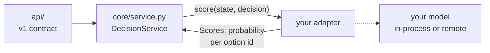

# Adding a JEV engine

This guide takes a new JEV-style model from "it exists" to "any client of the bridge can use it
by changing `JEV_ENGINE`". It covers the adapter contract, the two kinds of adapter, a complete
template for each, tests, packaging and the measurements to run before trusting the engine.

The rule that shapes everything: **an adapter only scores.** Given a state and a decision, it
returns one probability per option id. It does not validate the request, pick the winner, apply
the threshold, time the call or format the response. `DecisionService` does all of that the
same way for every engine. That is what keeps the API identical whatever sits behind it.



## Step 0: you may not need code

Check whether the model already speaks a protocol the bridge supports.

| The model is served by... | Do this | Code needed |
|---|---|---|
| A server that speaks **TypeSafe System One** (`POST /v1/systemone`): [Kev](https://github.com/jaredpalmer/kev) (tested), hosted Jev and [RizzoFlow](https://github.com/Rizzo-AI-Academy/rizzo-flow) (same protocol, not yet tested), or anything compatible | `JEV_ENGINE=systemone`, `JEV_SYSTEMONE_URL=...`, and optionally `JEV_SYSTEMONE_MODEL`, `JEV_SYSTEMONE_API_KEY` | None |
| The same server, but you want a named preset with its own defaults (as `kev` has) | Add one factory in `adapters/registry.py` (see [Named presets](#named-presets-of-a-protocol-adapter)) | About 8 lines |
| Anything else | Write an adapter, as described below | One package |

## Step 1: choose in-process or remote

| | In-process adapter | Remote (protocol) adapter |
|---|---|---|
| The model runs... | Inside the bridge process (PyTorch, transformers...) | In its own server; the adapter is an HTTP client |
| Examples | `semif`, `laya` | `systemone` (`kev`), `rizzoflow` |
| Extra Python dependencies | Yes, and they must fit the bridge's environment | None (stdlib `urllib`) |
| Hardware | The bridge's image (the published images use CPU PyTorch) | Whatever the model server has: GPU, Apple Silicon, another machine |
| Latency | No network hop | One local HTTP hop (about 1 ms on localhost) |
| Failure isolation | A crash or out-of-memory error takes down the bridge | The bridge stays up and answers `503 ENGINE_UNAVAILABLE` |
| Docker image | Model code (and optionally weights) baked in | Small; the model server is deployed separately or as a sidecar |

**Choose in-process** when the model's dependencies are compatible with the bridge (Python 3.11,
the torch and transformers versions in `uv.lock`) and it runs well on the bridge's hardware.

**Choose remote** when any of these is true:

- the model needs a different Python, torch or transformers version;
- it ships a native runtime (llama.cpp, MLX, CUDA graphs) or needs a GPU;
- it already has its own server;
- it should scale or fail independently of the bridge.

This is why `rizzoflow` and `kev` are remote. RizzoFlow downloads a hardware-specific llama.cpp
build and a 1.8–4.4 GB GGUF at runtime (`rizzo download`, which needs Python ≥ 3.12). Kev requires
Python ≥ 3.12, `torch < 2.9` and CUDA/MLX for good speed. The bridge's image runs Python 3.11 with
torch 2.14. Embedding either would mean forking the bridge's environment for one engine, and one
engine's failure would stop the whole service.

## Step 2: the contract

`src/jev_agentbridge/core/ports.py`:

```python
class DecisionAdapter(Protocol):
    def info(self) -> EngineInfo: ...
    def is_ready(self) -> bool: ...
    def score(self, *, state: State, decision: Decision) -> Scores: ...
    def score_batch(self, *, state: State, decisions: Sequence[Decision]) -> list[Scores]: ...
```

### Inputs (`core/models.py`)

- `state`: `str | dict | list`, exactly as the client sent it. Serialize it the way your model
  expects (semif uses sorted compact JSON; Laya and System One accept objects natively).
- `decision.question`: the criterion text.
- `decision.options`: a tuple of `Option(id, description)`, 2–16 of them, with unique ids. The
  service has already validated this, so do not re-validate.
- `decision.min_selected_probability`: ignore it. The threshold is the service's job.

### Output: `Scores`

| Field | Rule |
|---|---|
| `probabilities` | **One entry per option id** of the decision, keyed by `option.id` (not by letter, index or label). Values in [0, 1], summing to about 1. Extra keys are ignored. A missing id is an `ENGINE_ERROR`. |
| `input_tokens` | Optional. Set it if your model knows the count; it appears in `metadata.input_tokens`. |
| `details` | Optional dict of engine-specific diagnostics (prompt hash, the backend's own confidence, status). Returned as `metadata.engine_details`, not interpreted, and not part of the stable contract. |

Return the model's **probability of each option**. If the backend reports some other
"confidence" (Laya's 1 − normalized entropy, Kev's rescaled `(p_max − 1/K)/(1 − 1/K)`), keep
it in `details`. Never put it in `probabilities`: the acceptance threshold compares
`probabilities[winner]` against `min_selected_probability`, and it must mean the same thing for
every engine.

### `info()` → `EngineInfo`

| Field | Meaning |
|---|---|
| `name` | The engine name, as in `JEV_ENGINE` and `metadata.engine` |
| `model` | Model identifier (Hugging Face id, server model name...) |
| `revision` | Model revision, or the server URL for remote adapters |
| `native_batch` | `True` if `score_batch` is cheaper than N `score` calls (shared prefix, one request) |
| `thread_safe` | `False` makes the service serialize calls behind a lock. Use `False` unless you are sure. |
| `native_types` | Question types the engine scores natively. Default `{"choice"}`. Add `"noul"` and/or `"score"` only if the model has a real yes/no or ordinal path. |

### Question types

Every decision has a `type`: `choice`, `noul` (yes/no) or `score` (ordinal scale). All three
reach the adapter in the same shape, a `Decision` with options:

| `decision.type` | `decision.options` | `probabilities` keys to return |
|---|---|---|
| `choice` | the options | the option ids |
| `noul` | `yes`, `no` (descriptions "Yes"/"No" unless the caller gave `yes_description` / `no_description`; `decision.custom_noul_descriptions()` returns them or `None`) | `yes`, `no` |
| `score` | the levels, **lowest first** | the level ids |

The service only sends types listed in `native_types`. Any other type is **emulated**: it
arrives as `type="choice"` over the same options, so an adapter that only does choice is
already complete. The service computes the score's expected level from `probabilities`; do not
return it (put the backend's own score in `details` if you want it visible).

If your backend's answer for a type is keyed differently (System One and Laya return score
levels as `"0"`, `"1"`...; RizzoFlow returns `true`/`false`), map it back to the option ids in
the adapter. Measure native against emulated with
[`examples/eval/question_types`](../examples/eval/question_types) before declaring a type
native: a native head is not automatically better.

### `is_ready()`

Return `True` once `score` can be served. Remote adapters return `True` and let an unreachable
server surface per request as `503 ENGINE_UNAVAILABLE`, so a server restart does not require a
bridge restart.

### Errors (`core/errors.py`)

Raise these when you can classify a failure. Any other exception becomes `500 ENGINE_ERROR`.

| Raise | HTTP / code | When |
|---|---|---|
| `InputTooLargeError` | 413 `INPUT_TOO_LARGE` | The prompt exceeds the model's context or a configured limit |
| `EngineUnavailableError` | 503 `ENGINE_UNAVAILABLE` | A remote server cannot be reached or timed out |
| `EngineError` | 500 `ENGINE_ERROR` | The backend answered something outside the contract (HTTP 4xx/5xx, malformed answer) |

## Step 3: write the adapter

Create a package `src/jev_agentbridge/adapters/<name>/` with an empty `__init__.py` and an
`adapter.py`. Conventions:

- A frozen `<Name>Config` dataclass with `from_env()` reading **its own** variables, named
  `JEV_<NAME>_*`. Do not add engine settings to `runtime/settings.py`, which holds only
  service-wide settings.
- A `<Name>Adapter` class with a `from_config()` classmethod that does the expensive work
  (loading weights). Keep `__init__` cheap and injectable, so tests can pass fakes.
- Import heavy dependencies inside `from_config()`, not at module level, so other engines
  never import them.

### Template: in-process adapter

```python
"""MyJev adapter: <one line on how the model scores options>."""

from __future__ import annotations

import os
import threading
from dataclasses import dataclass
from typing import Any, Sequence

from ...core.errors import InputTooLargeError
from ...core.models import Decision, Scores, State
from ...core.ports import EngineInfo


@dataclass(frozen=True)
class MyJevConfig:
    model_name: str = "org/myjev-1b"
    device: str = "cpu"
    max_input_tokens: int = 4096

    @classmethod
    def from_env(cls) -> "MyJevConfig":
        return cls(
            model_name=os.getenv("JEV_MYJEV_MODEL_NAME", cls.model_name),
            device=os.getenv("JEV_MYJEV_DEVICE", cls.device),
            max_input_tokens=int(os.getenv("JEV_MYJEV_MAX_INPUT_TOKENS", str(cls.max_input_tokens))),
        )


class MyJevAdapter:
    def __init__(self, *, model: Any, model_name: str, max_input_tokens: int) -> None:
        self._model = model
        self._model_name = model_name
        self._max_input_tokens = max_input_tokens
        self._lock = threading.Lock()

    @classmethod
    def from_config(cls, config: MyJevConfig) -> "MyJevAdapter":
        import myjev  # heavy import only when this engine is selected

        model = myjev.load(config.model_name, device=config.device)
        return cls(model=model, model_name=config.model_name,
                   max_input_tokens=config.max_input_tokens)

    def info(self) -> EngineInfo:
        return EngineInfo(name="myjev", model=self._model_name, native_batch=False,
                          thread_safe=True)  # True because score() takes self._lock

    def is_ready(self) -> bool:
        return True

    def score(self, *, state: State, decision: Decision) -> Scores:
        with self._lock:
            out = self._model.predict(
                state=state,
                question=decision.question,
                options={o.id: o.description for o in decision.options},
            )
        if out.input_tokens > self._max_input_tokens:
            raise InputTooLargeError(f"{out.input_tokens} tokens > {self._max_input_tokens}")
        return Scores(
            probabilities={o.id: float(out.probs[o.id]) for o in decision.options},
            input_tokens=out.input_tokens,
            details={"backend_confidence": out.confidence},
        )

    def score_batch(self, *, state: State, decisions: Sequence[Decision]) -> list[Scores]:
        return [self.score(state=state, decision=d) for d in decisions]  # no shared path
```

### Template: remote adapter

Copy `adapters/systemone/adapter.py` or `adapters/rizzoflow/adapter.py`. The essentials:

- use the stdlib `urllib` (no new dependency), with a configurable timeout;
- map `URLError` and `TimeoutError` to `EngineUnavailableError`, and HTTP errors or
  malformed answers to `EngineError`;
- set `thread_safe=True` (stateless client) and, if the protocol accepts several questions
  per request, `native_batch=True` with one request in `score_batch`;
- keep only the option ids of the decision from the server's probabilities (servers may add
  internal keys, as RizzoFlow's `__abstain__` does).

### Named presets of a protocol adapter

`kev` is not a separate adapter. It is the System One adapter with Kev's defaults and its own
`JEV_KEV_*` variables:

```python
def _kev() -> DecisionAdapter:
    from .systemone.adapter import SystemOneAdapter, SystemOneConfig

    config = SystemOneConfig.from_env(
        "JEV_KEV", engine_name="kev", base_url="http://localhost:8009", model="kev-latest"
    )
    return SystemOneAdapter.from_config(config)
```

Add a preset like this when a System One server has well-known defaults.

## Step 4: register it

`src/jev_agentbridge/adapters/registry.py`: one factory plus one entry.

```python
def _myjev() -> DecisionAdapter:
    from .myjev.adapter import MyJevAdapter, MyJevConfig

    return MyJevAdapter.from_config(MyJevConfig.from_env())


_ADAPTERS = {
    ...
    "myjev": _myjev,
}
```

`JEV_ENGINE=myjev` now selects it, and `GET /v1/info` lists it in `available_engines`.

## Step 5: dependencies and images (in-process only)

1. Add the model's package to `pyproject.toml`. Check first that it resolves with the existing
   lock (`uv lock`). If it needs another Python, torch or transformers version, stop and write
   a remote adapter instead (Step 1).
2. `uv lock` and commit `uv.lock`. The Dockerfile installs from the lock (`uv sync --frozen`).
3. Add the engine name to the `engine` matrix in `.github/workflows/ci.yml` (image build check)
   and `.github/workflows/release.yml`. The release publishes `:<engine>` and
   `:X.Y.Z-<engine>` tags with `JEV_ENGINE` baked in.

Remote adapters need no dependency. Adding them to the release matrix is optional; it only
produces an image with `JEV_ENGINE` preset.

## Step 6: tests

Add `tests/test_<name>_adapter.py`. The tests must not download a model or need a server. Fake
the backend (see `tests/test_laya_adapter.py` for an in-process fake and
`tests/test_systemone_adapter.py` for a mocked HTTP layer). Cover at least:

- the request your adapter sends (prompt, payload, headers) for one decision;
- probabilities keyed by option id, including when the backend uses other keys;
- `score_batch` returns one `Scores` per decision, in order, and uses the shared path if there
  is one;
- each error class: unreachable, HTTP error, input too large;
- the result through `DecisionService`: winner, `accepted`, `metadata.engine`.

Then extend `tests/test_registry.py`: add the name to `test_known_engines_are_registered`,
and the adapter to `test_adapters_satisfy_the_port`.

```bash
uv run ruff check src tests
PYTHONPATH=. uv run pytest tests -q
```

## Step 7: run it for real

```bash
# in-process
JEV_ENGINE=myjev uv run python -m uvicorn jev_agentbridge.main:app --port 8000
# remote: start the model server first, then point the bridge at it
JEV_ENGINE=systemone JEV_SYSTEMONE_URL=http://localhost:8009 uv run python -m uvicorn jev_agentbridge.main:app --port 8000

curl localhost:8000/v1/info
curl -X POST localhost:8000/v1/decide -H "Content-Type: application/json" \
  -d '{"state":"Deploy failed: health check timeout","question":"Next step?","options":[{"id":"retry","description":"Retry"},{"id":"abort","description":"Abort"}]}'
```

Check that `metadata.engine` is your engine, that `probabilities` has exactly your option ids,
and that stopping a remote server gives `503 ENGINE_UNAVAILABLE`, not a 500.

## Step 8: measure before recommending it

An engine that answers is not an engine you can trust. Run the same measurements every engine
went through, and add the numbers to [performance.md](performance.md):

1. `python -m benchmarks.run --engine myjev`: cold start and warm latency (in-process engines).
2. `jev-eval` on `examples/eval/sample.jsonl` and `sample_it.jsonl`: quick sanity check.
3. The [model-routing suite](../examples/eval/model_routing/):
   `python run_eval.py run --url http://localhost:8000 --label myjev`, then `report`. Compare
   against the existing rows and the LLM baseline in `results/REPORT.md`.

Report accuracy per language and coverage at the 95% target, not only overall accuracy.

## Checklist

- [ ] `adapters/<name>/adapter.py` with config (`JEV_<NAME>_*`) and adapter; heavy imports in `from_config()`
- [ ] Probabilities keyed by option id; backend "confidence" only in `details`
- [ ] Errors mapped to `InputTooLargeError` / `EngineUnavailableError` / `EngineError`
- [ ] `thread_safe` and `native_batch` set honestly
- [ ] `native_types` lists only the types the backend really supports, each mapped back to option ids
- [ ] Registered in `adapters/registry.py`
- [ ] Dependencies locked, CI and release matrices updated (in-process)
- [ ] Adapter tests with a fake backend; registry tests extended; ruff and pytest green
- [ ] Measured with `jev-eval` and the model-routing suite; numbers in `docs/performance.md`
- [ ] README engines table, `docs/architecture.md` engines table and CHANGELOG updated
