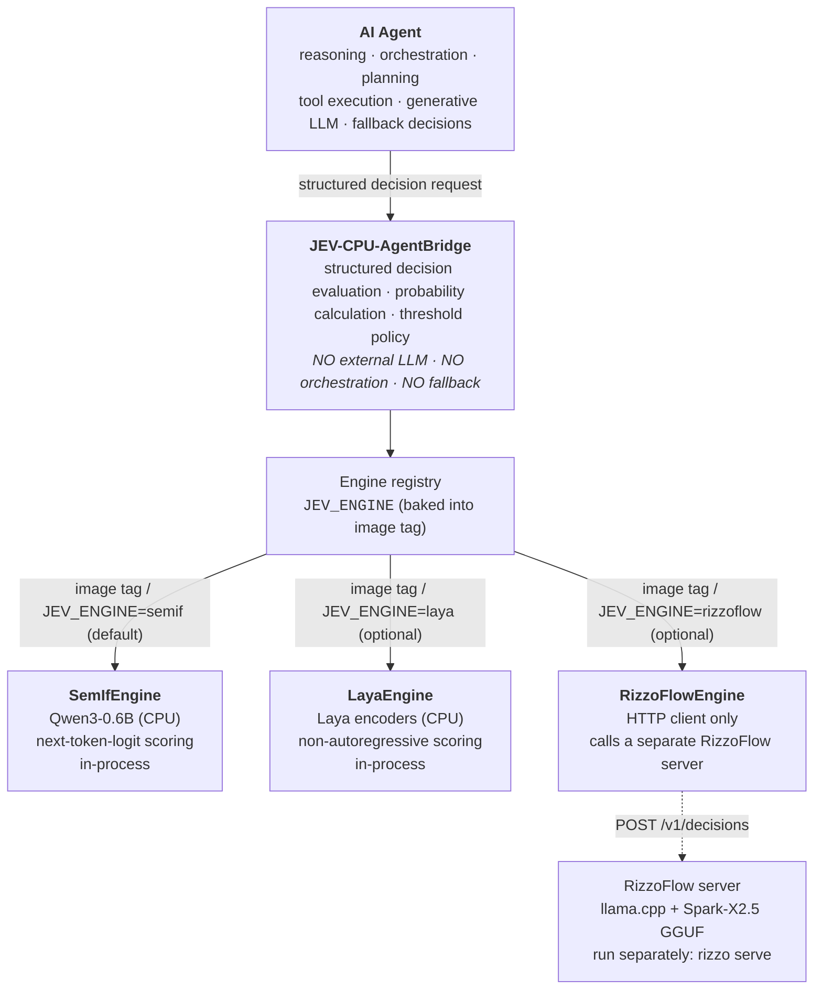
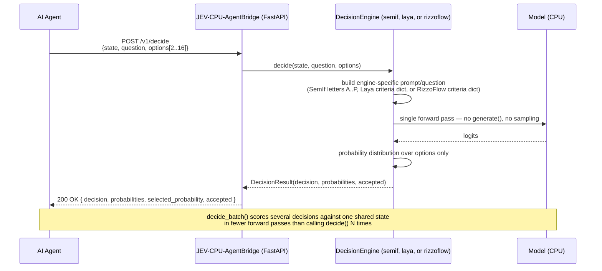

# Architecture



## Sequence diagram



## Separation of concerns

The Bridge answers: *"Given this state, criterion and these possible actions, which option receives the highest score from the local decision model?"*

It does NOT answer: *"What should the entire agent do?"*

## Components

- **API layer**: FastAPI routes for `/v1/decide`, `/v1/decide/batch`, `/health`, `/ready`, `/v1/info`
- **Engine registry** (`engine/registry.py`): picks a `DecisionEngine` implementation from `JEV_ENGINE`
- **Decision engines**: pluggable implementations of the `DecisionEngine` protocol
  - `SemIfEngine` (default, `JEV_ENGINE=semif`): next-token-logit scoring on a causal LM (Qwen3-0.6B), in-process
  - `LayaEngine` (`JEV_ENGINE=laya`, optional): non-autoregressive scoring via the [Laya](https://github.com/NandhaKishorM/laya) encoder models, in-process
  - `RizzoFlowEngine` (`JEV_ENGINE=rizzoflow`, optional): thin HTTP client (stdlib only, no extra
    dependency) to a separately-run [RizzoFlow](https://github.com/Rizzo-AI-Academy/rizzo-flow)
    server (`rizzo serve`), which does llama.cpp + Spark-X2.5 GGUF scoring on its own
- **Prompt builder**: Constructs SemIf-style prompts (used by `SemIfEngine` only)
- **Tokenizer slots**: Validates A-P token mapping (used by `SemIfEngine` only)
- **Model loader**: Loads Qwen3-0.6B with CPU inference (used by `SemIfEngine` only)

## Swapping engines

The API contract (`/v1/decide`, `/v1/decide/batch`, response shape) never changes when you switch
engines — only `engine/registry.py` needs a new entry. Published images bake the engine into the
image itself, so the tag you pull determines the runtime engine:

| Image tag | Engine | Notes |
|---|---|---|
| `:latest` / `:semif` | `semif` (default) | Qwen3-0.6B causal LM, next-token scoring |
| `:laya` | `laya` | Laya encoder models — dependencies baked in |
| `:rizzoflow` | `rizzoflow` | HTTP client to a separately-run RizzoFlow server; also usable as a general JEV integration point |

```bash
docker run -p 8000:8000 ghcr.io/giskardb/jev-agentbridge:latest   # semif
docker run -p 8000:8000 ghcr.io/giskardb/jev-agentbridge:laya     # laya
docker run -p 8000:8000 ghcr.io/giskardb/jev-agentbridge:rizzoflow # rizzoflow
```

You can still override the baked-in engine at runtime with `-e JEV_ENGINE=...` if you need to.
For `rizzoflow`, set `JEV_RIZZOFLOW_URL` (default `http://localhost:8017`) to point at the server
you run separately.

Adding a fourth backend means writing a `DecisionEngine` implementation and registering it in
`_ENGINES` in `engine/registry.py` — nothing in `api/` or the SDKs changes. If it needs its own
Python dependencies (like Laya), add a matching extra in `pyproject.toml` and a matrix entry in
`.github/workflows/release.yml` so it gets its own image tag; if it's just an HTTP client (like
RizzoFlow), it doesn't need either.
