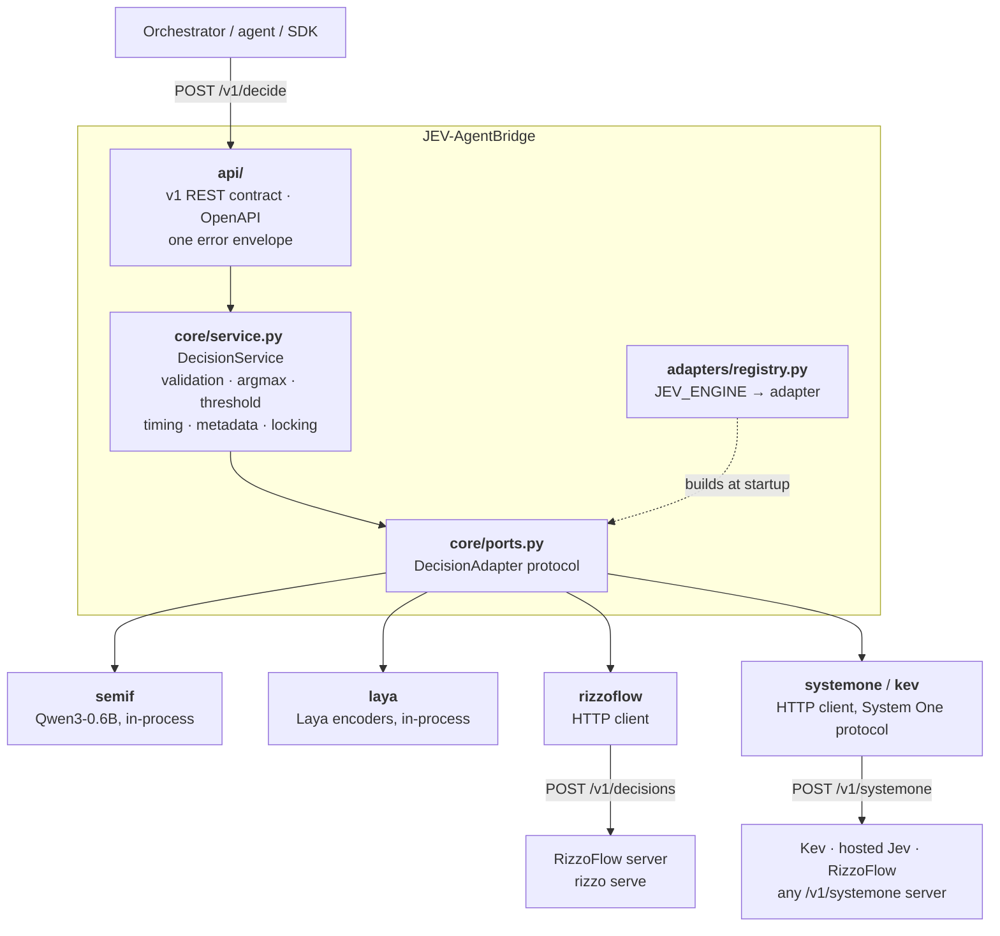
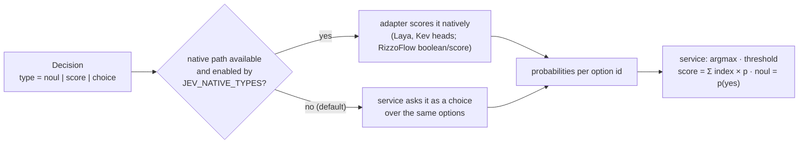
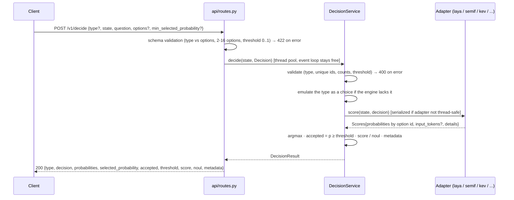
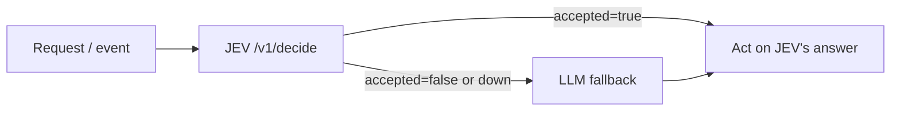

# Architecture

JEV-AgentBridge is the **standardization bridge toward JEV decision models**: a standard
decision REST API with **pluggable engine adapters** behind it (ports & adapters). Clients only
ever see the v1 contract; which JEV-style engine scores the options is an implementation detail
chosen at deploy time.



Two kinds of adapter sit behind the port. **In-process** adapters (`semif`, `laya`) load the
model inside the bridge. **Remote** adapters (`systemone`, its `kev` preset, and `rizzoflow`)
are HTTP clients to a model server that runs separately, on its own hardware and with its own
dependencies. Remote adapters are written per *protocol*, not per model. TypeSafe's System One
API (`/v1/systemone`) is spoken by hosted Jev, Kev and RizzoFlow, so one adapter covers all of
them.

## Layers and responsibilities

| Layer | Package | Owns | Knows about engines? |
|---|---|---|---|
| REST contract | `api/` | Request/response schemas (`schemas.py`), routes, error envelope, OpenAPI | No |
| MCP layer | `api/mcp.py` | `/mcp` endpoint (streamable HTTP) with `jev_yes_no`, `jev_choose`, `jev_score`, `jev_decide_batch`, `jev_info`, calling the same `DecisionService` | No |
| Domain + policy | `core/` | `Option`, `Decision` (with its question type), `Scores`, `DecisionResult`; validation, type emulation, argmax, score expected level, acceptance threshold, timing, standard metadata, domain errors | No |
| Port | `core/ports.py` | `DecisionAdapter` protocol + `EngineInfo` | Defines the contract |
| Adapters | `adapters/<name>/` | Scoring only: turn a `Decision` into one probability per option id; own config from own env vars | Each knows only itself |
| Composition | `adapters/registry.py`, `main.py` | Pick the adapter from `JEV_ENGINE`, build the app | Only the registry |

The key rule: **an adapter scores, the service decides.** Adapters never apply the threshold,
never choose the winner and never shape the response. That is what keeps behaviour identical
across engines. Before 0.4.0, for example, semif returned probabilities keyed by letters
`A`/`B` while laya and rizzoflow used option ids. Each engine also re-implemented the
threshold, and the per-request threshold never reached any of them.

## Question types

JEV questions come in three types: `choice` (one category), `noul` (yes/no) and `score`
(a level on an ordinal scale). The domain carries all three as a `Decision` with options, so the
port does not change: a noul has the options `yes`/`no`, a score has its levels, lowest first.



The expected level and P(yes) are computed by the service, not taken from the engine, so they
mean the same thing whatever answers. `metadata.native_type` records which path was used.
Native paths are off by default (`JEV_NATIVE_TYPES=false`): measured on the question-types
suite they were never better, and Laya's native score was clearly worse (see
[api.md](api.md#question-types)).

## Request flow



`/v1/decide/batch` follows the same path through `score_batch()`. Adapters with a cheaper shared
path (`native_batch=True`) use it: semif prefills the shared state once and reuses the KV cache.
Laya, rizzoflow and the System One adapters send one request with all the questions.

## The adapter port

```python
class DecisionAdapter(Protocol):
    def info(self) -> EngineInfo: ...          # name, model, revision, native_batch, thread_safe, native_types
    def is_ready(self) -> bool: ...
    def score(self, *, state, decision: Decision) -> Scores: ...
    def score_batch(self, *, state, decisions: Sequence[Decision]) -> list[Scores]: ...
```

`Scores.probabilities` must contain every option id of the decision. Anything adapter-specific
(prompt hash, backend status, token counts) goes in `Scores.details`. It is returned to clients
under `metadata.engine_details` without being interpreted.

Adapters raise domain errors from `core/errors.py` when they can classify the failure:
`InputTooLargeError` (413) and `EngineUnavailableError` (503, e.g. RizzoFlow unreachable). Any
other exception becomes `ENGINE_ERROR` (500). Every error uses the same envelope.

`thread_safe=False` makes the service serialize calls to that adapter. Routes run in FastAPI's
thread pool, so a slow CPU decision no longer blocks `/health`, `/ready` or other requests.

## Adding a new engine

See **[adding-an-engine.md](adding-an-engine.md)**. It covers when no code is needed (a System
One server), how to choose between in-process and remote, the exact adapter contract, templates,
registration, packaging, tests and the measurements to run. In short, a new engine is one
package in `adapters/<name>/` plus one line in `adapters/registry.py`. Nothing in `api/`,
`core/`, the SDKs or client code changes.

## Engines and image tags

| Image tag | `JEV_ENGINE` | Adapter | Engine-specific settings |
|---|---|---|---|
| `:latest` / `:laya` | `laya` (default) | Laya encoder, non-autoregressive | `JEV_LAYA_MODEL_NAME`, `JEV_LAYA_SUBFOLDER` (default `multilingual`; `english` for the English model), `JEV_MODEL_DEVICE` |
| `:semif` | `semif` | Causal LM, next-token scoring of option letters A–P | `JEV_MODEL_NAME`, `JEV_MODEL_REVISION`, `JEV_MODEL_DEVICE`, `JEV_MAX_INPUT_TOKENS`, `JEV_SEMIF_PROMPT_VERSION` (`direct-options-v1` default, `direct-options-v2` recommended) |
| `:rizzoflow` | `rizzoflow` | HTTP client to a separately-run RizzoFlow server (native `/v1/decisions`) | `JEV_RIZZOFLOW_URL`, `JEV_RIZZOFLOW_TIMEOUT_SECONDS` |
| `:kev` | `kev` | System One client preset for a [Kev](https://github.com/jaredpalmer/kev) server (`python -m kev.serve`) | `JEV_KEV_URL` (default `http://localhost:8009`), `JEV_KEV_MODEL` (default `kev-latest`), `JEV_KEV_MODEL_REVISION` (what you pinned the server's `KEV_RUN` to — System One's response never reports it), `JEV_KEV_API_KEY`, `JEV_KEV_TIMEOUT_SECONDS` |
| any, with `-e JEV_ENGINE=systemone` | `systemone` | Generic System One client: hosted Jev, Kev, RizzoFlow or any compatible server | `JEV_SYSTEMONE_URL`, `JEV_SYSTEMONE_MODEL`, `JEV_SYSTEMONE_MODEL_REVISION`, `JEV_SYSTEMONE_API_KEY`, `JEV_SYSTEMONE_TIMEOUT_SECONDS` |

Service-wide settings: `JEV_ENGINE`, `JEV_MIN_SELECTED_PROBABILITY` (default threshold, 0.60),
`JEV_NATIVE_TYPES` (default `false`: noul and score are asked as a choice; `true` or a list
such as `noul` uses the engine's native paths), `JEV_MCP_ENABLED`, `JEV_HOST`, `JEV_PORT`.

## Where it sits in an agent

The Bridge is meant to be called from the orchestrator's code as a **gate in front of the
LLM**. It is not meant as a tool the LLM calls: by the time an LLM emits a tool call, its cost
has already been paid.



The SDKs implement this as `decide_or_fallback()` / `decideOrFallback()`. Pick the threshold per
decision type with `jev-eval` (see [performance.md](performance.md#accuracy-and-threshold)).

## Separation of concerns

The Bridge answers: *"Given this state and this closed question (yes/no, one of these options,
or a level on this scale), what is the most likely answer, and is it confident enough?"* It does not orchestrate, generate text, or resolve its own
uncertainty. `accepted=false` hands the decision back to the caller.
