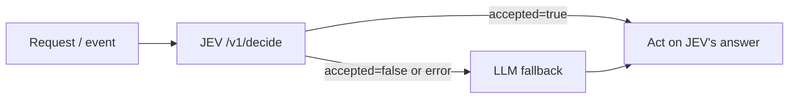

# Integration Guide

## Recommended pattern: a gate in the orchestrator, in front of the LLM

Call the Bridge from your orchestrator code (Java, Node, Python...), at decision points where you
would otherwise call an LLM just to classify: model routing, intent triage, input guardrails,
"does this need retrieval/tools?", retry/abort in error handlers. If JEV is confident, use its
answer. If not, or if the Bridge is down, ask the LLM.



Exposing `jev_decide` as a tool *the LLM calls* (the OpenCode plugin below) saves nothing. The
LLM has already been invoked to emit the tool call, and a second LLM turn is needed to read the
result. Use that only when you want an auditable, calibrated selection step inside an agent.

Choose each decision type's threshold with `jev-eval` ([performance.md](performance.md#accuracy-and-threshold))
and pass it per request as `min_selected_probability`.

### Node / TypeScript

```ts
import { AgentBridgeClient } from 'jev-agentbridge-sdk'

const jev = new AgentBridgeClient('http://localhost:8000', 2_000)
const outcome = await jev.decideOrFallback(
  {
    state: userMessage.slice(0, 2000),
    question: 'What kind of request is this?',
    options: [
      { id: 'faq', description: 'Simple question answerable from the FAQ' },
      { id: 'code', description: 'Request to write or change code' },
      { id: 'analysis', description: 'Complex analysis that needs reasoning' },
    ],
    min_selected_probability: 0.85,
  },
  async (request) => classifyWithLlm(request), // must return one option id
)
// outcome.source === 'jev' → free; 'fallback' → the LLM answered
```

### Python

```python
from jev_agent_bridge import AgentBridgeClient

jev = AgentBridgeClient("http://localhost:8000", timeout=2.0)
outcome = jev.decide_or_fallback(
    state=user_message[:2000],
    question="What kind of request is this?",
    options=ROUTES,
    min_selected_probability=0.85,
    fallback=lambda request: classify_with_llm(request),
)
print(outcome.decision_id, outcome.source)
```

### Java (plain HTTP)

The API is plain JSON over HTTP, so no SDK is needed:

```java
var body = """
  {"state": %s, "question": "What kind of request is this?",
   "options": [{"id":"faq","description":"..."},{"id":"code","description":"..."}],
   "min_selected_probability": 0.85}""".formatted(jsonString(userMessage));
var request = HttpRequest.newBuilder(URI.create("http://localhost:8000/v1/decide"))
    .timeout(Duration.ofSeconds(2))
    .header("Content-Type", "application/json")
    .POST(HttpRequest.BodyPublishers.ofString(body)).build();
// parse "accepted" and "decision.id"; on accepted=false, non-2xx or timeout → call the LLM
```

## Choosing the engine

The Bridge API is identical for every engine (see [architecture.md](architecture.md)). The only difference is the image tag you run:

| Image tag | Runtime engine | What it is |
|---|---|---|
| `:latest` / `:laya` | `laya` (default) | Non-autoregressive encoder models, in-process. Best measured accuracy and latency |
| `:semif` | `semif` | Qwen3-0.6B causal LM, next-token scoring, in-process. Use `JEV_SEMIF_PROMPT_VERSION=direct-options-v2` |
| `:rizzoflow` | `rizzoflow` | HTTP client to a separately-run RizzoFlow server — also usable as a general JEV integration point |

The engine is baked into the image by the release pipeline, so `JEV_ENGINE` is not needed when
you pull the matching tag:

```bash
docker run -p 8000:8000 ghcr.io/giskardb/jev-agentbridge:latest   # laya
docker run -p 8000:8000 ghcr.io/giskardb/jev-agentbridge:semif    # semif
docker run -p 8000:8000 ghcr.io/giskardb/jev-agentbridge:rizzoflow # rizzoflow
```

For `rizzoflow`, set `JEV_RIZZOFLOW_URL` (default `http://localhost:8017`) to point at the
RizzoFlow server you run separately. The `:rizzoflow` image is a general JEV integration point —
you can replace the URL and talk to any RizzoFlow-compatible server you run yourself.

## Python SDK

```python
from jev_agent_bridge import AgentBridgeClient

client = AgentBridgeClient("http://localhost:8000")
result = client.decide(
    state="Deployment failed",
    question="What should happen next?",
    options=[
        {"id": "retry", "description": "Retry deployment"},
        {"id": "abort", "description": "Abort deployment"},
    ],
)
print(result["decision"]["id"])
```

## TypeScript SDK

```ts
import { AgentBridgeClient } from 'jev-agentbridge-sdk'
const client = new AgentBridgeClient('http://localhost:8000')
const result = await client.decide({...})
```

## OpenCode integration

See `integrations/opencode/`. This exposes `jev_decide` as a tool the LLM calls; see the note at
the top of this page on why that does not reduce LLM cost.
