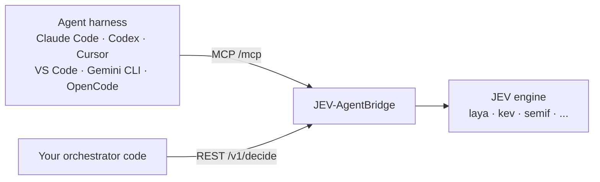

# MCP: JEV tools for coding agents

The bridge serves the [Model Context Protocol](https://modelcontextprotocol.io) at **`/mcp`**,
on the same port as the REST API. Any MCP-capable agent harness (Claude Code, Codex CLI, Cursor,
VS Code, Gemini CLI, OpenCode, Windsurf...) gets the JEV decision tools with one configuration
entry: no plugin, no SDK. The tools call the same `DecisionService` as `/v1/decide`, so the
engine, the threshold policy and the response are identical.



## MCP or REST?

| Use | When |
|---|---|
| **REST** (`/v1/decide`, SDKs) | *Your code* decides when to ask JEV, typically as a gate before an LLM call. This is the pattern that saves LLM calls. See [integration.md](integration.md). |
| **MCP** (`/mcp`) | *The agent* decides when to ask JEV, as a tool. The agent's LLM is already running, so this does not save LLM tokens. Its value is a calibrated, auditable selection by a dedicated model, with a confidence the agent can act on. |

## Start the bridge

```bash
docker run -p 8000:8000 ghcr.io/giskardb/jev-agentbridge:latest   # laya
docker compose -f docker-compose.kev.yml up                       # Kev, more accurate
```

The MCP endpoint is `http://localhost:8000/mcp`. It uses the streamable HTTP transport (stateless,
JSON responses). `JEV_MCP_ENABLED=false` turns it off.

## Tools

One tool per JEV question type, so the agent picks the type by picking the tool:

| Tool | Arguments | Returns |
|---|---|---|
| `jev_yes_no` | `state` (string, object or array), `question`, `yes_description` / `no_description` (optional), `min_selected_probability` (optional) | `decision.id` `yes` or `no`, `noul` (P(yes)), `probabilities`, `selected_probability`, `accepted`, `threshold`, `metadata` |
| `jev_choose` | `state`, `question`, `options` (2–16 `{id, description}`), `min_selected_probability` (optional) | The chosen option, a probability per option id, `accepted`, `threshold`, `metadata` |
| `jev_score` | `state`, `question`, `levels` (2–16 `{id, description}`, lowest first), `min_selected_probability` (optional) | The most likely level as `decision`, `score` (expected level, 0 = first), `probabilities`, `accepted`, `metadata` |
| `jev_decide_batch` | `state`, `decisions` (list of `{type?, question, options?, yes_description?, no_description?, min_selected_probability?}`, types can be mixed), `min_selected_probability` (optional, batch default) | `{"decisions": [...]}`, one result per decision, in order |
| `jev_info` | none | Active engine and model, its native question types, API version, default threshold, option limits |

The results are the ones `/v1/decide` returns (see [api.md](api.md#question-types)). 0.5.x
had a single `jev_decide`; it is now `jev_choose`. Harnesses discover tools at connection time,
so no configuration changes.

All tools are marked read-only and idempotent. Errors come back as MCP tool errors carrying the
same codes as the REST API: `ENGINE_UNAVAILABLE: ...`, `MODEL_NOT_READY: ...`,
`INPUT_TOO_LARGE: ...`. The server also sends usage **instructions** at initialization: when to
call the tools (a closed question with known answers, context already gathered), which tool
fits which question, and how to read
`accepted: false` (decide yourself, it does not mean "no"). Harnesses that support MCP server
instructions show them to the model automatically.

## Configure your agent

Replace `localhost:8000` if the bridge runs elsewhere. The "Verified" column says what was
checked against a running bridge on 2026-09-24.

| Harness | Configuration | Verified |
|---|---|---|
| Claude Code | `claude mcp add --transport http jev http://localhost:8000/mcp` | Yes, connected |
| OpenCode | `opencode.json` below | Yes, connected |
| Gemini CLI | `~/.gemini/settings.json` or `.gemini/settings.json` below | Yes, connected (the folder must be trusted) |
| OpenAI Codex CLI | `codex mcp add jev --url http://localhost:8000/mcp` | Configuration accepted; connection not tested |
| Cursor | `.cursor/mcp.json` below | Not tested; format from Cursor's documentation |
| VS Code (GitHub Copilot agent mode) | `.vscode/mcp.json` below | Not tested; format from VS Code's documentation |
| Windsurf | `~/.codeium/windsurf/mcp_config.json` below | Not tested; format from Windsurf's documentation |

### Claude Code

```bash
claude mcp add --transport http jev http://localhost:8000/mcp            # just you, this project
claude mcp add --transport http --scope project jev http://localhost:8000/mcp  # shared via .mcp.json
```

`--scope project` writes a `.mcp.json` you can commit:

```json
{ "mcpServers": { "jev": { "type": "http", "url": "http://localhost:8000/mcp" } } }
```

Check with `claude mcp list`. The tools appear as `mcp__jev__jev_yes_no` and so on.

### OpenAI Codex CLI

```bash
codex mcp add jev --url http://localhost:8000/mcp
```

That writes to `~/.codex/config.toml`:

```toml
[mcp_servers.jev]
url = "http://localhost:8000/mcp"
```

### Cursor

`.cursor/mcp.json` in the project (or `~/.cursor/mcp.json` for all projects):

```json
{ "mcpServers": { "jev": { "url": "http://localhost:8000/mcp" } } }
```

### VS Code (GitHub Copilot)

`.vscode/mcp.json`:

```json
{ "servers": { "jev": { "type": "http", "url": "http://localhost:8000/mcp" } } }
```

### Gemini CLI

`.gemini/settings.json` in the project, or `~/.gemini/settings.json`:

```json
{ "mcpServers": { "jev": { "httpUrl": "http://localhost:8000/mcp" } } }
```

Gemini CLI disables MCP servers in folders you have not trusted; trust the folder when it asks.

### OpenCode

`opencode.json` in the project:

```json
{
  "$schema": "https://opencode.ai/config.json",
  "mcp": { "jev": { "type": "remote", "url": "http://localhost:8000/mcp", "enabled": true } }
}
```

### Windsurf

`~/.codeium/windsurf/mcp_config.json`:

```json
{ "mcpServers": { "jev": { "serverUrl": "http://localhost:8000/mcp" } } }
```

### Clients that only support stdio

Bridge stdio to HTTP with [`mcp-remote`](https://www.npmjs.com/package/mcp-remote):

```json
{ "mcpServers": { "jev": { "command": "npx", "args": ["-y", "mcp-remote", "http://localhost:8000/mcp"] } } }
```

## Teach the agent when to use it (optional)

The MCP instructions cover the basics. For more reliable tool selection, add the skill in
[`integrations/skills/jev-agentbridge/SKILL.md`](../integrations/skills/jev-agentbridge/SKILL.md):
the decision gate, the false-positive cases, and how to read `accepted`.

- Claude Code: copy the folder to `.claude/skills/jev-agentbridge/` (or `~/.claude/skills/`).
- OpenCode: copy it to `.opencode/skills/jev-agentbridge/`.
- Other harnesses: paste its "The gate" and "Reading the result" sections into your project
  rules (`AGENTS.md`, `.cursor/rules/`, `GEMINI.md`...).

## Test it without an agent

```bash
npx @modelcontextprotocol/inspector
```

Connect to `http://localhost:8000/mcp` with the "Streamable HTTP" transport, list the tools and
call `jev_yes_no`.

## Security

The endpoint has no authentication, like the REST API. Keep the bridge on localhost or a private
network. When it listens on `127.0.0.1` (the default outside Docker), the MCP endpoint only
accepts `localhost` Host and Origin headers, which blocks DNS-rebinding attacks from web pages.
In Docker it listens on `0.0.0.0` and that check is off, so do not publish the port beyond the
machines that need it.
